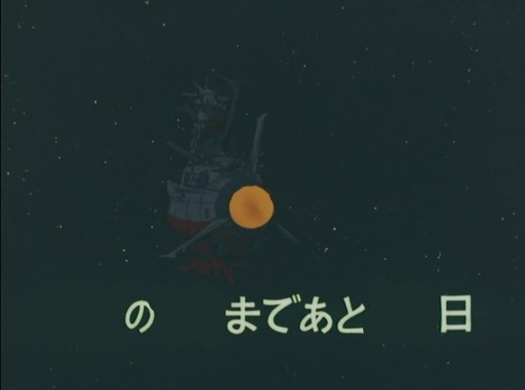

# 事務関連マニュアル
## 休日出勤について
前日

# ここで追加

**休日**無いケースも
## 経費の精算について
主な適用項目は以下の通りです。
-  資料代
- 通信費
- 消耗品代

|適用|内容
|---|--
|資料代|書籍 有料アプリ
|通信費|携帯代 SIM費
|消耗品代|ノート キャラクターバインダー
|交通費|電車、バス代

## 宅配便の配送について
## 電話、来客対応について
## ごみ収集について
## プリンタについて
## 大容量データの送受信について

